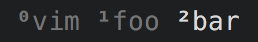

# n2s
Transform number characters to subscript or superscripts.

Works only on Python3.

Created to be used on tmux status bar:

## Usage
Example usage in tmux status bar window index, add this line to your tmux theme file:

`setw -g window-status-format "#[bold]#(path-to/num2sup.py #I)#[nobold]#W "`

You may have to add the python3 command:

`setw -g window-status-format "#[bold]#(python3 path-to/num2sup.py #I)#[nobold]#W "`

